# Combined graph

## Graph

```mermaid
%%{ init: { 'flowchart': { 'curve': 'monotoneX' } } }%%
flowchart LR
    id0((0))
    id1(((1)))
    id2(((2)))
    id0-->|b|id2
    id3(((3)))
    id2-->|o|id3
    id4(((4)))
    id3-->|o|id4
    id5(((5)))
    id4-->|l|id5
    id6(((6)))
    id5-->|e|id6
    id7(((7)))
    id6-->|a|id7
    id8(((8)))
    id7-->|n|id8
    id9(((9)))
    id2-->|r|id9
    id10(((10)))
    id9-->|e|id10
    id11(((11)))
    id10-->|a|id11
    id12(((12)))
    id11-->|k|id12
    id13(((13)))
    id0-->|c|id13
    id14(((14)))
    id13-->|o|id14
    id15(((15)))
    id14-->|n|id15
    id16(((16)))
    id15-->|t|id16
    id17(((17)))
    id16-->|i|id17
    id18(((18)))
    id17-->|n|id18
    id19(((19)))
    id18-->|u|id19
    id20(((20)))
    id19-->|e|id20
    id21(((21)))
    id0-->|e|id21
    id22(((22)))
    id21-->|l|id22
    id23(((23)))
    id22-->|s|id23
    id24(((24)))
    id23-->|e|id24
    id25(((25)))
    id0-->|f|id25
    id26(((26)))
    id25-->|l|id26
    id27(((27)))
    id26-->|o|id27
    id28(((28)))
    id27-->|a|id28
    id29(((29)))
    id28-->|t|id29
    id30(((30)))
    id25-->|o|id30
    id31(((31)))
    id30-->|r|id31
    id32(((32)))
    id0-->|i|id32
    id33(((33)))
    id32-->|f|id33
    id34(((34)))
    id32-->|n|id34
    id35(((35)))
    id34-->|t|id35
    id36(((36)))
    id0-->|r|id36
    id37(((37)))
    id36-->|e|id37
    id38(((38)))
    id37-->|t|id38
    id39(((39)))
    id38-->|u|id39
    id40(((40)))
    id39-->|r|id40
    id41(((41)))
    id40-->|n|id41
    id42(((42)))
    id0-->|v|id42
    id43(((43)))
    id42-->|o|id43
    id44(((44)))
    id43-->|i|id44
    id45(((45)))
    id44-->|d|id45
    id46(((46)))
    id0-->|w|id46
    id47(((47)))
    id46-->|h|id47
    id48(((48)))
    id47-->|i|id48
    id49(((49)))
    id48-->|l|id49
    id50(((50)))
    id49-->|e|id50
    id51(((51)))
    id0-->|t|id51
    id52(((52)))
    id51-->|r|id52
    id53(((53)))
    id52-->|u|id53
    id54(((54)))
    id53-->|e|id54
    id55(((55)))
    id25-->|a|id55
    id56(((56)))
    id55-->|l|id56
    id57(((57)))
    id56-->|s|id57
    id58(((58)))
    id57-->|e|id58
    id0-->|letter|id1
    id2-->|"letter | digit"|id1
    id3-->|"letter | digit"|id1
    id4-->|"letter | digit"|id1
    id5-->|"letter | digit"|id1
    id6-->|"letter | digit"|id1
    id7-->|"letter | digit"|id1
    id8-->|"letter | digit"|id1
    id9-->|"letter | digit"|id1
    id10-->|"letter | digit"|id1
    id11-->|"letter | digit"|id1
    id12-->|"letter | digit"|id1
    id13-->|"letter | digit"|id1
    id14-->|"letter | digit"|id1
    id15-->|"letter | digit"|id1
    id16-->|"letter | digit"|id1
    id17-->|"letter | digit"|id1
    id18-->|"letter | digit"|id1
    id19-->|"letter | digit"|id1
    id20-->|"letter | digit"|id1
    id21-->|"letter | digit"|id1
    id22-->|"letter | digit"|id1
    id23-->|"letter | digit"|id1
    id24-->|"letter | digit"|id1
    id25-->|"letter | digit"|id1
    id26-->|"letter | digit"|id1
    id27-->|"letter | digit"|id1
    id28-->|"letter | digit"|id1
    id29-->|"letter | digit"|id1
    id30-->|"letter | digit"|id1
    id31-->|"letter | digit"|id1
    id32-->|"letter | digit"|id1
    id33-->|"letter | digit"|id1
    id34-->|"letter | digit"|id1
    id35-->|"letter | digit"|id1
    id36-->|"letter | digit"|id1
    id37-->|"letter | digit"|id1
    id38-->|"letter | digit"|id1
    id39-->|"letter | digit"|id1
    id40-->|"letter | digit"|id1
    id41-->|"letter | digit"|id1
    id42-->|"letter | digit"|id1
    id43-->|"letter | digit"|id1
    id44-->|"letter | digit"|id1
    id45-->|"letter | digit"|id1
    id46-->|"letter | digit"|id1
    id47-->|"letter | digit"|id1
    id48-->|"letter | digit"|id1
    id49-->|"letter | digit"|id1
    id50-->|"letter | digit"|id1
    id51-->|"letter | digit"|id1
    id52-->|"letter | digit"|id1
    id53-->|"letter | digit"|id1
    id54-->|"letter | digit"|id1
    id55-->|"letter | digit"|id1
    id56-->|"letter | digit"|id1
    id57-->|"letter | digit"|id1
    id58-->|"letter | digit"|id1

    nu1(((79)))
    nu2(((80)))
    nu3((81))
    nu4((82))
    nu5(((83)))
    nu6((84))
    nu7(((85)))

    id0-->|digit|nu1
    nu1-->|digit|nu1
    nu1-->|.|nu2
    nu1-->|eE|nu3
    nu2-->|eE|nu3
    nu2-->|digit|nu7
    nu3-->|+-|nu4
    nu3-->|digit|nu5
    nu4-->|digit|nu5
    nu5-->|digit|nu5

    id0-->|.|nu6
    nu6-->|digit|nu7
    nu7-->|digit|nu7
    nu7-->|eE|nu3

    op1(((59)))
    op2(((60)))
    op3(((61)))
    op4(((62)))
    op5((63))
    op6((64))
    op7(((65)))
    op8(((66)))
    op9(((67)))
    op10(((68)))
    op11(((69)))
    op12(((70)))
    op13(((71)))
    op14(((72)))
    op15(((73)))
    op16(((74)))
    op17((75))
    op18(((76)))
    op19((77))
    op20(((78)))

    id0-->|"+"|op1
    id0-->|"-"|op2
    
    id0-->|"/"|op4
    op4-->|"*"|op5
    op5-->|"*"|op6
    op5-->|any|op5
    op6-->|"/"|op7
    op6-->|"*"|op6
    op6-->|any|op5
    op4-->|"/"|op8
    op8-->|any|op8

    id0-->|"*"|op3

    id0-->|"<"|op9
    op9-->|"="|op10

    id0-->|"="|op11
    op11-->|"="|op12

    id0-->|">"|op13
    op13-->|"="|op14

    id0-->|"!"|op15
    op15-->|"="|op16

    id0-->|"|"|op17
    op17-->|"|"|op18

    id0-->|"&"|op19
    op19-->|"&"|op20

    se1(((86)))
    se2(((87)))
    se3(((88)))
    se4(((89)))
    se5(((90)))
    se6(((91)))
    se7(((92)))
    se8(((93)))

    id0-->|"{"|se1
    id0-->|"}"|se2
    id0-->|"["|se3
    id0-->|"]"|se4
    id0-->|"("|se5
    id0-->|")"|se6
    id0-->|","|se7
    id0-->|";"|se8

    wh(((94)))
    id0-->|"`' ', \t, \f, \r, \n`"|wh
```

## Notes

- Start state: 0 (id0)
- End state:
  - Keyword:
    - 8 (id8)
    - 12 (id12)
    - 20 (id20)
    - 24 (id24)
    - 29 (id29)
    - 31 (id31)
    - 33 (id33)
    - 35 (id35)
    - 41 (id41)
    - 45 (id45)
    - 50 (id50)
  - Identifier: \[1-58\] - \{8, 12, 20, 24, 29, 31, 33, 35, 41, 45, 50, 54, 58\}
  - Boolean literal:
    - 54 (id54)
    - 58 (id58)
  - Operator: \[59(op1)-78(op20)\] - \{63(op5), 64(op6), 65(op7), 66(op8), 75(op17), 77(op19)\}
  - Comment: 65 (op7), 66 (op8)
  - Int literal: 79 (nu1)
  - Float literal: 80 (nu2), 83 (nu5), 85 (nu7)
  - Seperator: \[86(se1)-93(se8)\]
  - Whitespace: 94 (wh)
